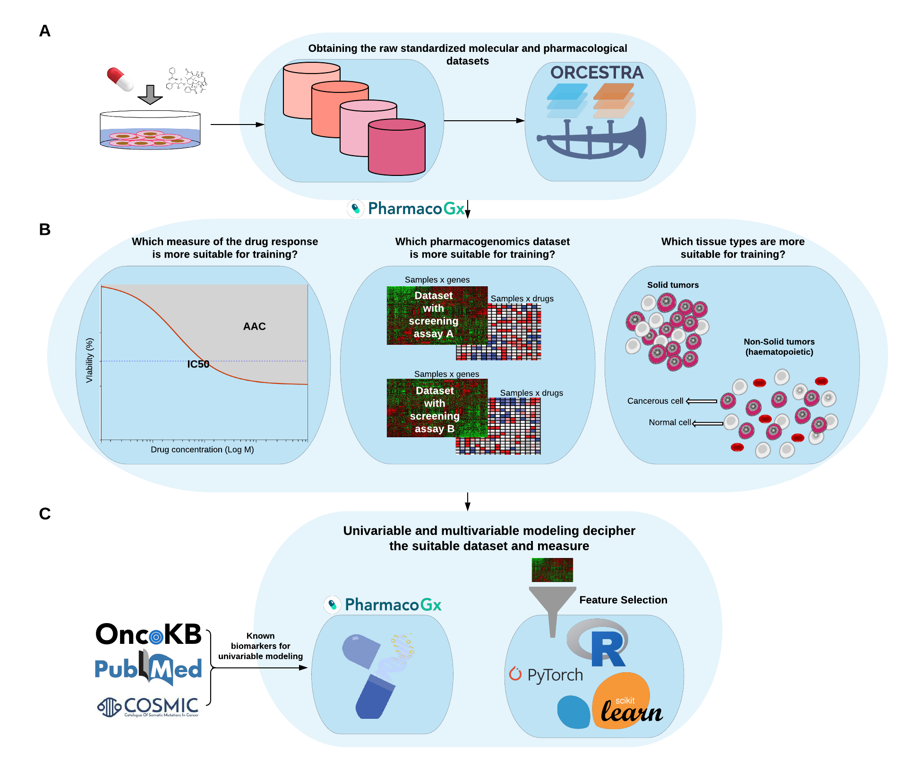

# PGx_Guidelines

Guidelines for Developing Machine Learning Models for Drug Sensitivity Prediction From Cell Line-Based Pharmacogenomics Data
===================



# Table of contents
1. [Installation](#installation)
2. [Datasets](#Datasets)
3. [Experiments](#Datasets)
4. [Citation](#citation)


# Installation

## Requirements
- Python 3
- Conda

To get the source files of PGx Guidelines you need to clone into its repository:
```
git clone https://github.com/bhklab/PGx_Guidelines
```

### Conda environment
All the required packages to run PGx Guidelines experiments are specified in `environment` subdirectory.
To install these packages run the following command:
```
conda env create -f PGx.yml
```
This command installs `PGxG` envrinment. 

After the successful installation of the packages into environmet you would be able to load them using `conda activate`.


# Datasets

## Download datasets
All of the utilized datasets for PGx Guidelines experiments are publicly available in the `PSet` format via ORCESTRA platform:
```
https://www.orcestra.ca/pset/stats
```

## Preprocess and load datasets
After downloading `PSet` objects, the molecular and pharmacological data can be extracted via `R` using codes provided in `Preprocess data` subdirectory. 

To load all datasets and Area above dose-response curve (AAC) data, run `LoadAllPSets.R`.

To load log transformed and truncated IC50 values, run `IC50Loading_logtruncated.R`.

`tissueType_encoding.csv` file is one-hot coding of tissue types which is added to molecular profiles to adjust for tissue type. 

Running `R` scripts generates the final datasets in `.tsv` format. Add them to a new subdirectory `Data_All`:

```
mkdir Data_All
```
By creating this subdirectory and adding all the data files to it, you will be able to re-run PGx Guidelines experiments. 
Alternatively, we have also provided these preprocessed files on [Zenodo](https://zenodo.org/record/4642024#.YF9-FK9KiUk). 

# Experiments

## Within-domain
For this analysis, we have provided the `Python` scripts as follows: 

- Ridge Regression: `Within-Ridge-aac.py` and `Within-Ridge-ic50.py`
```
sbatch ridge-wjob-aac.bs
sbatch ridge-wjob-ic50.bs

```
- Elastic Net: `Within-EN-aac.py` and `Within-EN-ic50.py`: 
```
sbatch en-wjob-aac.bs
sbatch en-wjob-ic50.bs
```
- Random Forest: `Within-RF-aac.py` and `Within-RF-ic50.py`.  
```
sbatch rf-wjob-aac.bs
sbatch rf-wjob-ic50.bs
```

## Cross-domain 
For this analysis, we have provided the Jupyter notebooks to run Ridge Regression (`Ridge.ipynb`), Elastic Net (`ElasticNet.ipynb`), and Random Forest (`RandomForest.ipynb`). For Deep Neural Networks experiments, we have provided `python` scripts in `DNN` subdirectory to run them. First you should create directories to sotre logs, models, and results. You should also add the path to these directories in `PGxGRun.bs`:
```
mkdir logs
mkdir models
mkdir results
sbatch PGxGRun.bs
```
We have also provided randomly generated hyperparameter settings in `filelistF10Uniquev1`. 

We have provided the model objects for the best settings of DNN experiments on [Zenodo](https://zenodo.org/record/4642024#.YF9-FK9KiUk).

## CTRPv2 vs. GDSCv1
For this analysis, we have provided the Jupyter notebook `GDSCv1.ipynb`.

## Impact of non-solid cell lines
For this analysis, we have provided the Jupyter notebook `SolidandnonSolid.ipynb`. For running the random subset experiment, run `SNRidge-aac.py` script. 

```
python SNRidge-aac.py
```

# Citation 
```
To be Updated...
```

